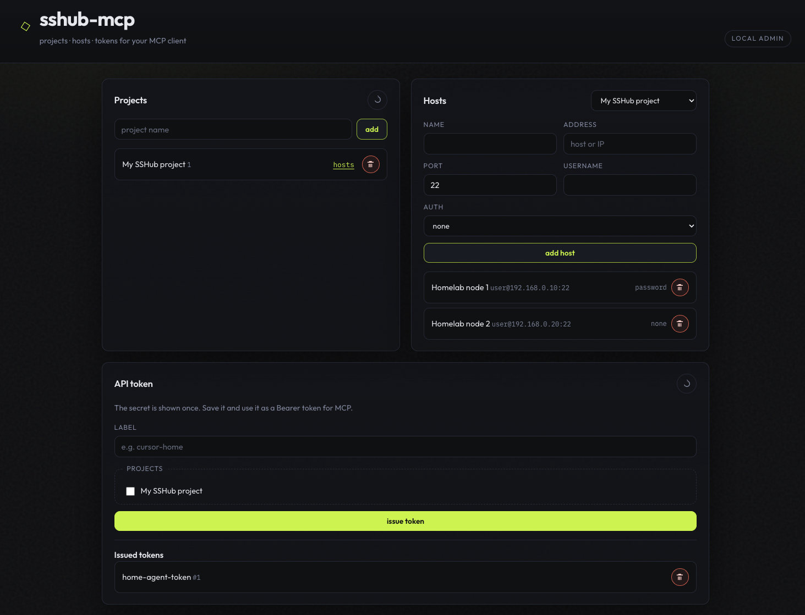

# sshub-mcp

Local HTTP **Model Context Protocol (MCP)** server for SSH automation:
- Projects
- SSH hosts (targets)
- API tokens
- MCP tools to open SSH sessions and run commands

Data is stored in **SQLite**. Intended to run **locally**.

## Install

### One-command install (recommended)

```bash
curl -sL https://raw.githubusercontent.com/vfaddey/sshub-mcp/main/install.sh | bash
```

What it does:
- downloads the latest release
- installs the binary into your `PATH` (`/usr/bin` on Linux; `/opt/homebrew/bin` or `/usr/local/bin` on macOS)
- installs a user service (systemd/launchd)
- starts it immediately

Install a specific version:

```bash
curl -sL https://raw.githubusercontent.com/vfaddey/sshub-mcp/main/install.sh | bash -s -- v0.0.2
```

### Build and run from source

Requirements: **Go 1.25+**

```bash
go build -o sshub-mcp ./cmd/sshub-mcp
./sshub-mcp
```

Or:

```bash
go run ./cmd/sshub-mcp
```

Default listen address: `127.0.0.1:8787`.

## Quick start

1. Start the server.
2. Open Admin UI: `http://127.0.0.1:8787/admin/`
3. Create a project and a host.
4. Issue a token.
5. Configure your MCP client to call:
   - MCP endpoint: `http://127.0.0.1:8787/mcp`
   - Header: `Authorization: Bearer <token>`

Important: the Admin UI has **no authentication**. Keep it on localhost.

## Admin UI



## Endpoints

- `/mcp` — MCP (Streamable HTTP), requires `Authorization: Bearer <token>`
- `/admin` — Admin UI + JSON API (no auth)

## MCP tools

All tool calls are scoped to the projects attached to the token.

- `list_projects` — list accessible projects
- `list_hosts` — list hosts for a `project_id`
- `ssh_create_session` — open SSH session (`project_id`, `host_id`) → `session_id`
- `ssh_exec` — execute a command (`session_id`, `command`)
- `ssh_close_session` — close a session (`session_id`)
- `ssh_list_sessions` — list active sessions for a `project_id`

## Configuration

| Variable | Default | Description |
|----------|---------|-------------|
| `SSHUB_MCP_HTTP_ADDR` | `127.0.0.1:8787` | Listen address |
| `SSHUB_MCP_DB` | platform default | SQLite database file |
| `SSHUB_MCP_SESSION_TTL` | `10m` | SSH session TTL (Go duration) |

Legacy names are supported if `SSHUB_MCP_*` is not set: `SSH_MCP_HTTP_ADDR`, `SSH_MCP_DB`, `SSH_MCP_SESSION_TTL`.

## Cursor (`mcp.json`) example

Global `~/.cursor/mcp.json` or project `.cursor/mcp.json`:

```json
{
  "mcpServers": {
    "sshub-mcp": {
      "url": "http://127.0.0.1:8787/mcp",
      "headers": {
        "Authorization": "Bearer ${env:SSHUB_MCP_TOKEN}"
      }
    }
  }
}
```

Create a token in the Admin UI and export it as `SSHUB_MCP_TOKEN`. Restart the editor after changing `mcp.json`.

## Admin HTTP API (brief)

Mounted under `/admin` (e.g. `http://127.0.0.1:8787/admin/`).
JSON bodies, `Content-Type: application/json`.

- `GET /api/projects` — list projects  
- `POST /api/projects` — create project (`{"name":"..."}`)  
- `DELETE /api/projects/{id}` — delete project  

- `GET /api/projects/{id}/hosts` — list hosts  
- `POST /api/projects/{id}/hosts` — create host  
- `DELETE /api/projects/{id}/hosts/{hostId}` — delete host  

- `POST /api/tokens` — issue token (`label`, `project_ids`), returns the secret **once**

`auth_kind`: `none` | `password` | `agent`.

## Host authentication (brief)

Private SSH keys are **not** stored in the database.

- `password`: password stored in SQLite
- `agent`: uses `SSH_AUTH_SOCK`
- `none`: uses agent if available; otherwise tries `~/.ssh/id_ed25519`, `id_ecdsa`, `id_rsa`

## Uninstall

### Linux (install.sh / tarball)

```bash
systemctl --user disable --now sshub-mcp
sudo rm /usr/bin/sshub-mcp
sudo rm /lib/systemd/user/sshub-mcp.service
systemctl --user daemon-reload
rm -rf ~/.local/share/sshub-mcp/
```

If `XDG_DATA_HOME` is set: `rm -rf "$XDG_DATA_HOME/sshub-mcp/"`.

### macOS (install.sh / tarball)

```bash
launchctl unload ~/Library/LaunchAgents/sshub-mcp.plist
sudo rm /opt/homebrew/bin/sshub-mcp   # or /usr/local/bin/sshub-mcp
rm ~/Library/LaunchAgents/sshub-mcp.plist
rm -rf ~/Library/Application\ Support/sshub-mcp/
```

### Debian package

```bash
systemctl --user disable --now sshub-mcp
sudo apt remove sshub-mcp
rm -rf ~/.local/share/sshub-mcp/
```

### Homebrew

```bash
brew services stop sshub-mcp
brew uninstall sshub-mcp
rm -rf ~/Library/Application\ Support/sshub-mcp/
```

## Contributing

PRs are welcome (bug fixes, tool improvements, Admin UI/UX, docs).

Before opening a PR:

```bash
go test ./...
```
